# Galeria completa de capturas de tela

Galeria estendida — o `README.md` traz apenas as 6 imagens principais (seção "Visão do sistema").
Ver `docs/images/screenshots/README.md` para o catálogo completo dos arquivos existentes.

## Produtos

### Listagem

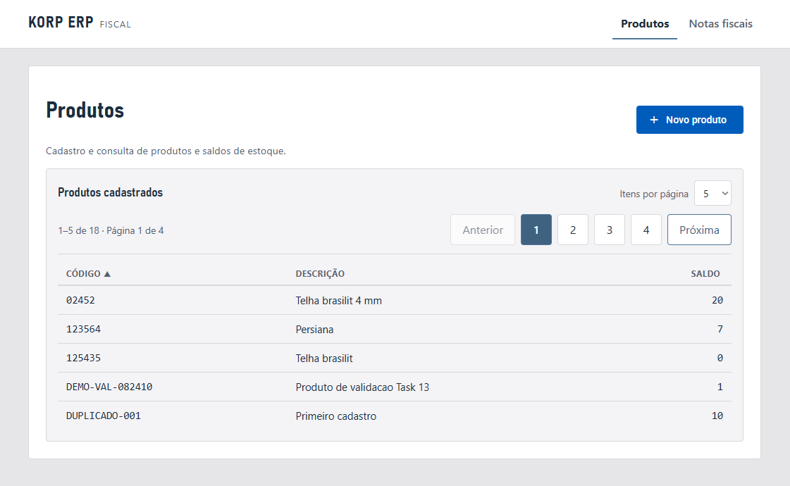

Listagem paginada de produtos (`Inventory.Api`), com colunas ordenáveis (código, descrição, saldo)
e controle de itens por página.

### Cadastro — formulário vazio

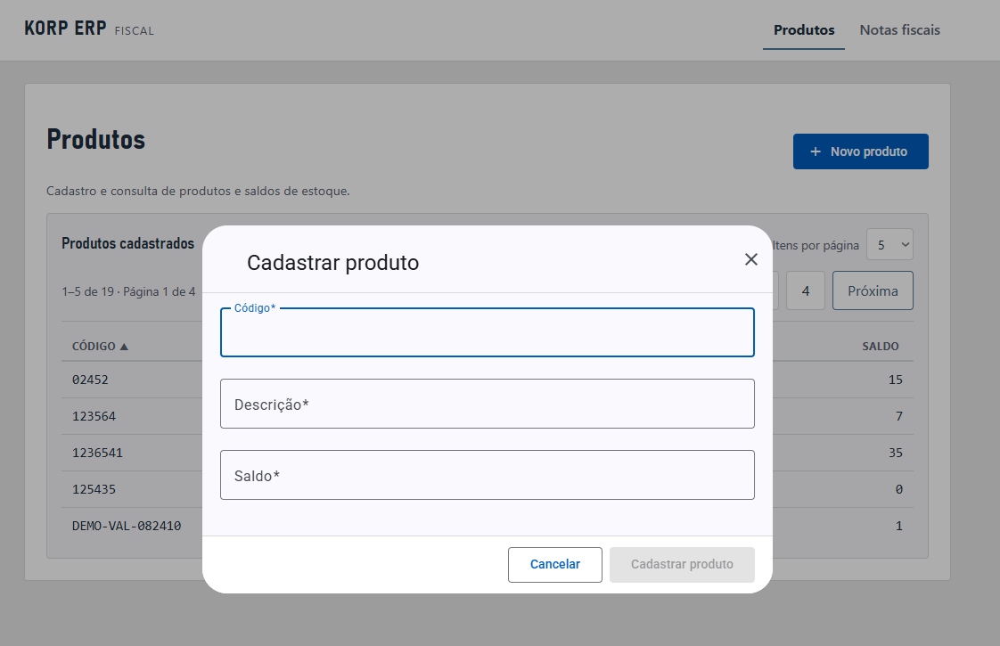

Modal de cadastro (Angular Material `MatDialog`). O campo de saldo inicial começa vazio — decisão
tomada na Task 15, já que `0` deixou de ser um valor inicial válido.

### Validação inline

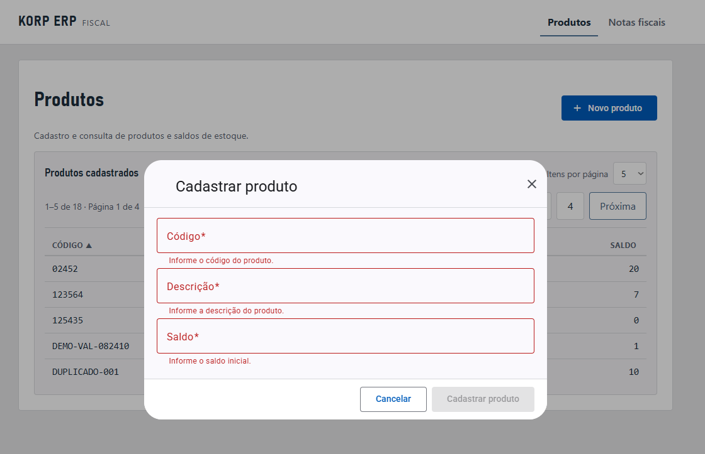

Validação client-side antes de qualquer chamada HTTP: código, descrição e saldo inicial
obrigatórios, com o botão "Cadastrar produto" desabilitado enquanto o formulário for inválido.

### Sucesso no cadastro

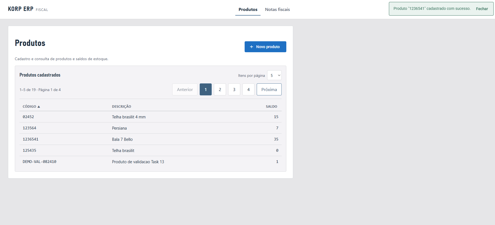

Após `POST /api/products` retornar `201 Created`, o modal fecha e a listagem é atualizada com o
novo produto; um único toast de sucesso é exibido.

### Indisponibilidade do serviço

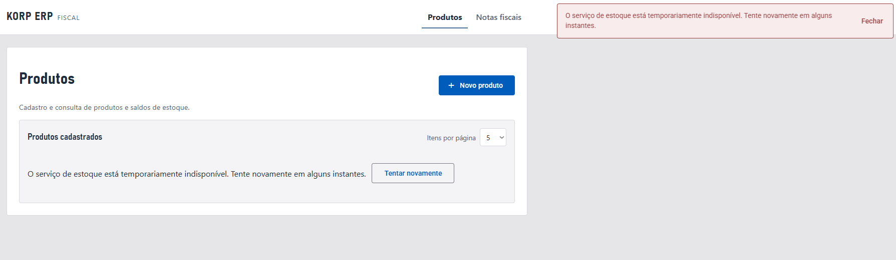

Estado de erro quando `Inventory.Api` (dono da própria listagem de produtos) está fora do ar:
mensagem amigável em português e ação de nova tentativa, sem stack trace exposto.

## Notas fiscais

### Listagem

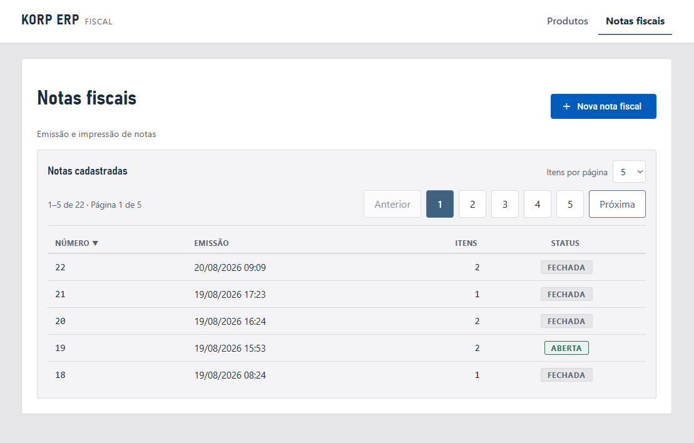

Listagem paginada de notas (`Billing.Api`), com badge de status (`ABERTA`/`FECHADA`) e ordenação
por número/emissão.

### Criação — múltiplos itens

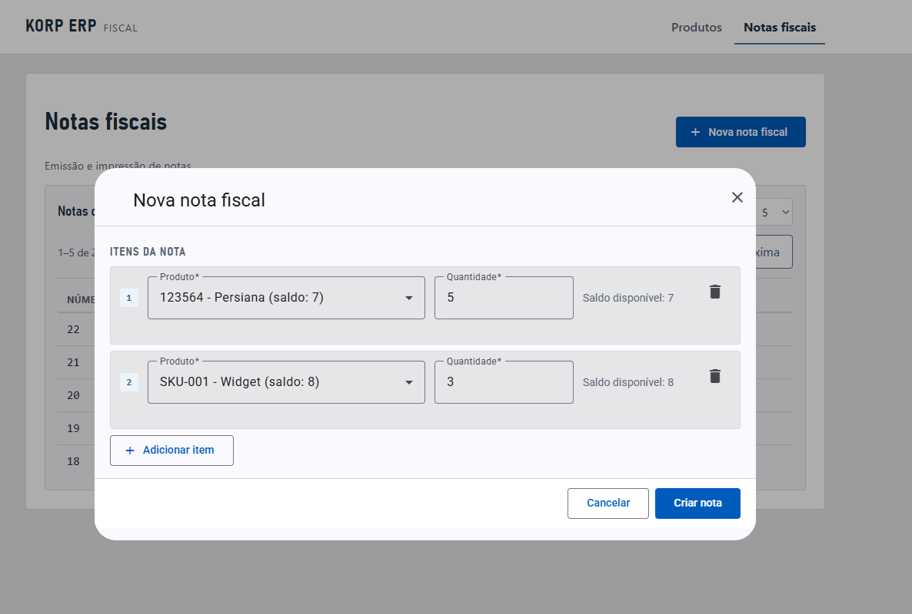

Formulário válido com múltiplos itens (`FormArray`), exibindo o saldo disponível de cada produto
selecionado e o botão "Criar nota" habilitado.

### Detalhe — nota aberta

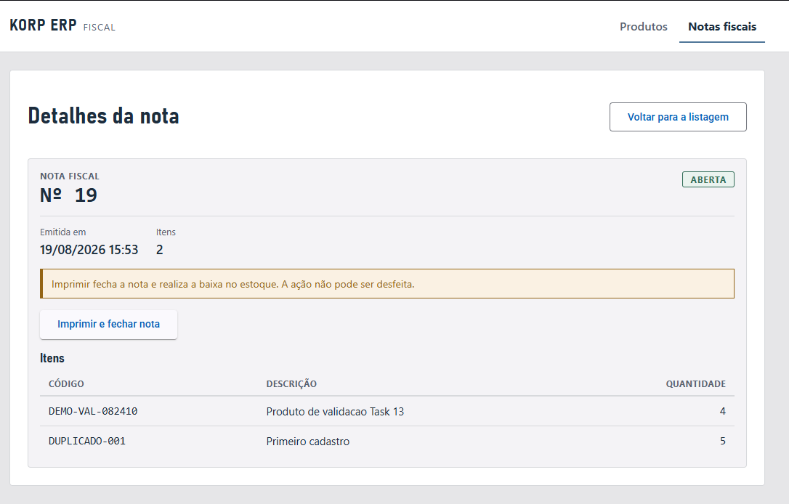

Nota recém-criada, status `ABERTA`, com aviso de que a impressão fecha a nota e realiza a baixa no
estoque (ação que não pode ser desfeita).

### Detalhe — saldo insuficiente

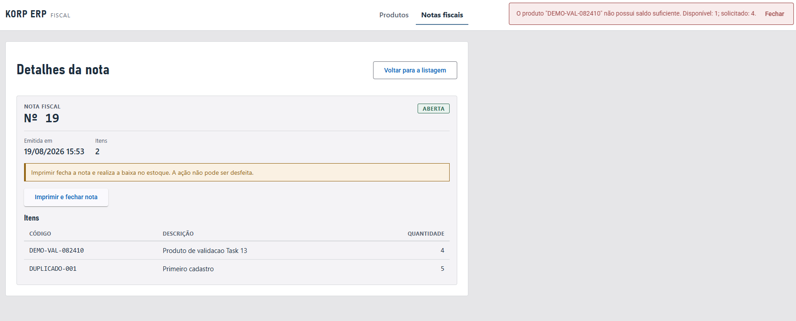

Tentativa de impressão rejeitada com `409` porque a quantidade solicitada excede o saldo
disponível do produto — a nota permanece `ABERTA` e o saldo não é alterado.

### Detalhe — nota fechada

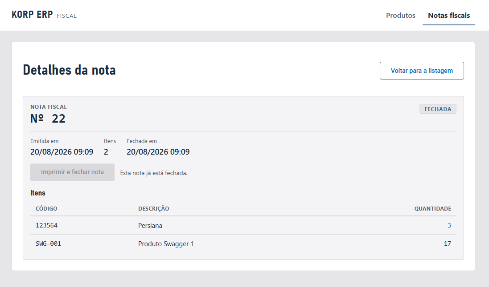

Após a impressão bem-sucedida: status `FECHADA`, data de fechamento preenchida e o botão
"Imprimir e fechar nota" desabilitado (não é possível reimprimir pela UI).

### Indisponibilidade do serviço

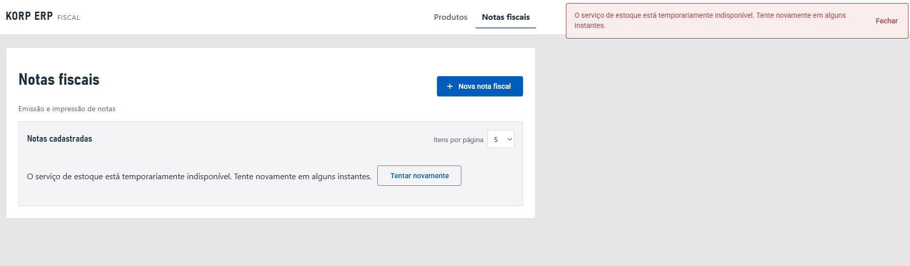

Estado de erro quando `Billing.Api` (dono da própria listagem de notas) está fora do ar: mesma
mensagem amigável e ação de nova tentativa da listagem de produtos, sem detalhes técnicos expostos
ao usuário.

## Impressão

### Visualização preparada para impressão

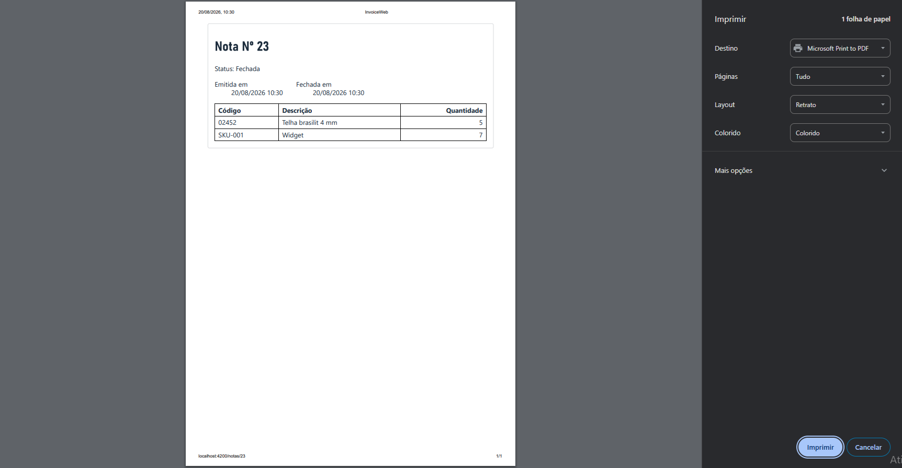

Diálogo de impressão do navegador (`window.print()`) mostrando apenas o conteúdo de
`invoice-print-view` — número, status `Fechada`, datas e itens — sem nenhum elemento da tela
normal (toast, navegação, botões). Captura tirada após a correção da Task 17 (ver
`docs/tasks/task-17-clean-invoice-print.md`); os cabeçalhos/rodapés visíveis (data, título, URL,
número de página) são adicionados pelo próprio navegador e ficam fora do controle da aplicação.

## Backend (Swagger)

### Billing.Api

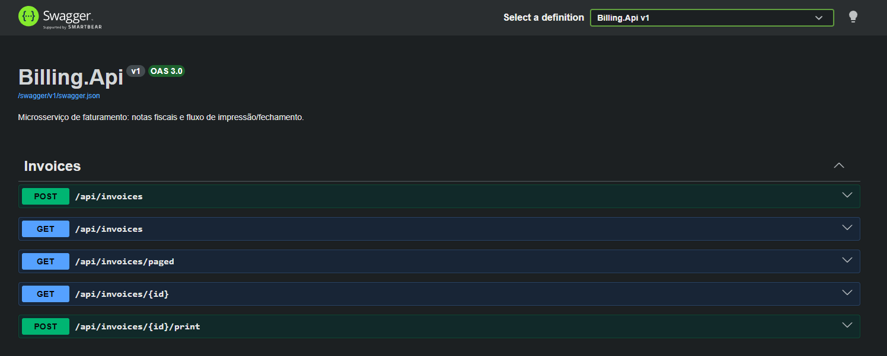

Documentação interativa (`OAS 3.0`) dos endpoints de notas: criação, listagem simples e paginada,
consulta por id e impressão/fechamento.

### Inventory.Api

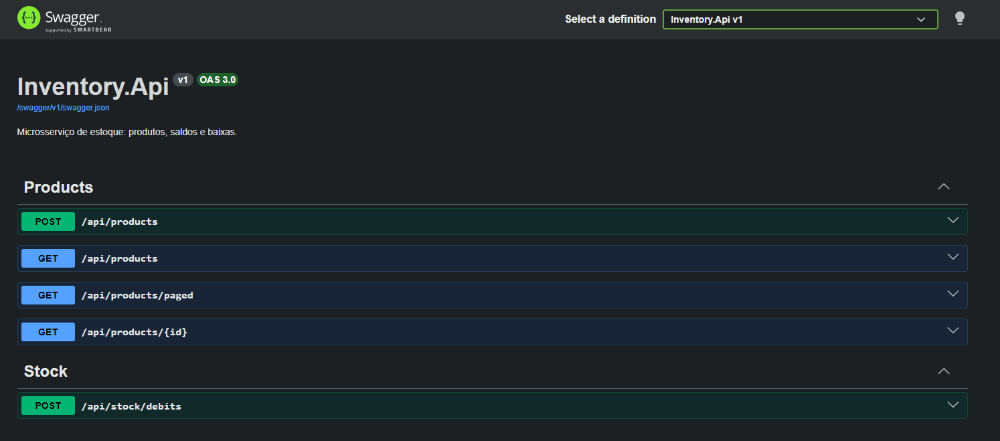

Documentação interativa (`OAS 3.0`) dos endpoints de produtos (criação, listagem simples e
paginada, consulta por id) e de baixa de estoque.
